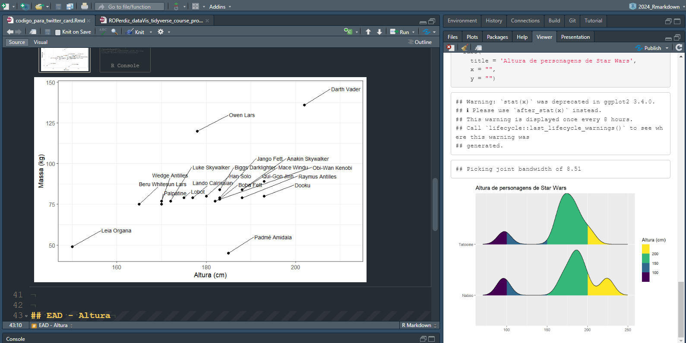

A sintaxe de *Markdown* é simples.
O [sabor (ou dialeto) de *Markdown*](https://pt.wikipedia.org/wiki/Markdown#Padroniza%C3%A7%C3%A3o) aqui empregado é o do [*Pandoc*](https://garrettgman.github.io/rmarkdown/authoring_pandoc_markdown.html).
Exponho[^inspirado-quarto] abaixo as notações mais comuns da linguagem neste dialeto.
Testem em seus documentos.  

[^inspirado-quarto]: As tabelas escritas em *Markdown* contendo código e sintaxe da linguagem foram abertamente inspiradas [nesta página](https://quarto.org/docs/authoring/markdown-basics.html#text-formatting), que ensina sobre a sintaxe de *Markdown* no livro sobre o Quarto.  

## Objetivos de aprendizado

+ Aprender a sintaxe básica de *Markdown*, sabor [*Pandoc*](https://garrettgman.github.io/rmarkdown/authoring_pandoc_markdown.html);
<!-- + Testar a sintaxe em documentos próprios para se ambientar com as possibilidades -->
+ Aprender a utilizar cabeçalhos para divisões no texto;
+ Aplicar formatação de texto (negrito, itálico, listas);
+ Inserir e executar blocos de código;
+ Entender a diferença entre texto e código no documento;
+ Incluir tabelas e gráficos gerados pelo código R;
+ Incorporar elementos visuais adicionais, como imagens e links.  

### Formatação

+-----------------------------------------+-----------------------------------------+
| Sintaxe                                 | Resultado                               |
+=========================================+=========================================+
| ``` markdown                            | *itálico* é _itálico_                   | 
| *itálico* é _itálico_                   | **negrito** é __negrito__               |
| **negrito** é __negrito__               |                                         |
| ```                                     |                                         |
+-----------------------------------------+-----------------------------------------+
| ``` markdown                            |  ***itálico e negrito***                |
| ***itálico e negrito***                 |                                         |
| ```                                     |                                         |
+-----------------------------------------+-----------------------------------------+
| ``` markdown                            | Sobrescrito^2^ / Subescrito~2~          |
| Sobrescrito^2^ / Subescrito~2~          |                                         |
| ```                                     |                                         |
+-----------------------------------------+-----------------------------------------+
| ``` markdown                            | ~~riscado~~                             |
| ~~Riscado~~                             |                                         |
| ```                                     |                                         |
+-----------------------------------------+-----------------------------------------+
| ``` markdown                            | `verbatim`                              |
| `verbatim`                              |                                         |
| ```                                     |                                         |
+-----------------------------------------+-----------------------------------------+
| ``` markdown                            |                                         |
| Traço --                                | Traço --                                |
| ```                                     |                                         |
+-----------------------------------------+-----------------------------------------+
| ``` markdown                            |                                         |
| Travessão ---                           | Travessão ---                           |
| ```                                     |                                         |
+-----------------------------------------+-----------------------------------------+
| ``` markdown                            |                                         |
| Régua horizontal                        | Régua horizontal                        |
|                                         |                                         |
| ***                                     | ***                                     |
| ```                                     |                                         |
+-----------------------------------------+-----------------------------------------+

### Cabeçalho {#cabecalhos}

+-----------------+-----------------------------------+
| Sintaxe         | Resultado                         |
+=================+===================================+
| ``` markdown    | # Cabeçalho 1 {.heading-output}   |
| # Cabeçalho 1   |                                   |
| ```             |                                   |
+-----------------+-----------------------------------+
| ``` markdown    | ## Cabeçalho 2 {.heading-output}  |
| ## Cabeçalho 2  |                                   |
| ```             |                                   |
+-----------------+-----------------------------------+
| ``` markdown    | ### Cabeçalho 3 {.heading-output} |
| ### Cabeçalho 3 |                                   |
| ```             |                                   |
+-----------------+-----------------------------------+
| ``` markdown    | #### Cab. 4   {.heading-output}   |
| #### Cab. 4     |                                   |
| ```             |                                   |
+-----------------+-----------------------------------+
| ``` markdown    | ##### Cab. 5 {.heading-output}    |
| ##### Cab. 5    |                                   |
| ```             |                                   |
+-----------------+-----------------------------------+
| ``` markdown    | ###### Cab. 6 {.heading-output}   |
| ###### Cab. 6   |                                   |
| ```             |                                   |
+-----------------+-----------------------------------+

```{=html}
<style type="text/css">
.heading-output {
  border-bottom: none;
  margin-top: 0;
  margin-bottom: 0;
}
</style>
```


### *Links* {#sec-link}

+--------------------------------------------------------------+--------------------------------------------------------------------------------------------------------+
| Sintaxe                                                      | Resultado                                                                                              |
+==============================================================+========================================================================================================+
| ``` markdown                                                 | <https://ufrr.br/>                                                                                     |
| <https://ufrr.br/>                                           |                                                                                                        |
| ```                                                          |                                                                                                        |
+--------------------------------------------------------------+--------------------------------------------------------------------------------------------------------+
| ``` markdown                                                 | [UFRR](https://ufrr.br/)                                                                               |
| [UFRR](https://ufrr.br/)                                     |                                                                                                        |
| ```                                                          |                                                                                                        |
+--------------------------------------------------------------+--------------------------------------------------------------------------------------------------------+


### Listas

+-----------------------------------+------------------------------------+
| Sintaxe                           | Resultado                          |
+===================================+====================================+
| ``` markdown                      |                                    |
| * Lista não ordenada              | * Lista não ordenada               |
|     + sub-item 1                  |     + sub-item 1                   |
|     + sub-item 2                  |     + sub-item 2                   |
|         - sub-sub-item 1          |         - sub-sub-item 1           |
| ```                               |                                    |
+-----------------------------------+------------------------------------+
| ``` markdown                      |                                    |
| *   item 2                        | *   item 2                         |
|                                   |                                    |
|     Item 2 continua - basta       |     Item 2 continua - basta        |
| inserir 4 espaços                 | inserir 4 espaços                  |
| ```                               |                                    |
+-----------------------------------+------------------------------------+
| ``` markdown                      |                                    |
| 1. Lista ordenada                 |  1. Lista ordenada                 |
| 2. item 2                         | 2. item 2                          |
|     i) sub-item 1                 |     i) sub-item 1                  |
|          A.  sub-sub-item 1       |         A.  sub-sub-item 1         |
| ```                               |                                    |
|                                   |                                    |
+-----------------------------------+------------------------------------+
| ``` markdown                      |                                    |
| (@)  Uma lista cuja numeração     |  (1) Uma lista cuja numeração      |
|                                   |                                    |
| continua após                     |  continua após                     |
|                                   |                                    |
| (@)  uma interrupção              |  (2) uma interrupção               |
| ```                               |                                    |
+-----------------------------------+------------------------------------+
| ``` markdown                      |                                    |
| termo                             | termo                              |
| : definição                       | : definição                        |
| ```                               |                                    |
+-----------------------------------+------------------------------------+

### Expressões matematicas

Expressões matemáticas podem ser inserir utilizando um cifrão, `$`, antes e depois da expressão.
Já equações matemáticas devem ser inseridas com um par de cifrões, `$$`, antes e depois da equação.
Logo, temos a expressão `$x = y $` que será compilada em:

$x = y$

Já a equação matemática `$$math-equation$$` é compilada para

$$math-equation$$

### Citação em blocos

Citações podem ser feitas em blocos por meio do acento circunflexo, `>`.
Basta inserir o `>` no início de uma linha e, em seguida, inserir text.  

```md
> Bloco de citação
```

O comando acima seria compilado e se tornaria o exibido abaixo:

> Bloco de citação


Outra opção é inserir o texto dentro de três crases:

```{python}
#| echo: false
#| output: asis
print("```")
print("Este texto será apresentado com um destaque visual.\n")
print("```")
```


Compilando o texto acima, teríamos:

```
Este texto será apresentado com um destaque visual.
```

Podemos também fazer uso de quatro espaços para destacar o texto:

```md
    Com quatro espaços, eu destaco o texto também.
```

Compilando o texto acima, teríamos:

    Com quatro espaços, eu destaco o texto também.

### Quebra de linha para criar parágrafos {#sec-paragrafo}

Podemos criar parágrafos com uma linha vazia entre sentenças:

```markdown
Este é um parágrafo.
Este parágrafo é composto de algumas sentenças.
Se eu quiser "quebrar" o parágrafo, isto é, ter dois parágrafos bem separados visualmente, eu deixo uma linha vazia entre os parágrafos.

Aqui eu inicio outro parágrafo.
E posso continuar escrevendo normalmente.
```

Caso processado, este texto ficaria assim:

> Este é um parágrafo. Este parágrafo é composto de algumas sentenças. Se eu quiser "quebrar" o parágrafo, isto é, ter dois parágrafos bem separados visualmente, eu deixo uma linha vazia entre os parágrafos.
>
> Aqui eu inicio outro parágrafo. E posso continuar escrevendo normalmente.


Se você não quiser um novo parágrafo mas apenas quebrar a linha, você deve usar dois espaços em branco (`  `) ao fim de uma linha.
Isso quebra a linha, e inicia a nova sentença na linha imediatamente inferior, porém sem adicionar um espaço considerável entre as linhas.
Veja:

```markdown
Este é um parágrafo.
Este parágrafo é composto de algumas sentenças.
Posso quebrar a linha utilizando dois espaços ao fim da linha.  
Desta maneira, esta linha que você lê neste momento está separada das linhas superiores, porém ainda em um mesmo bloco de texto.  
```

Compilando o trecho acima, temos:

> Este é um parágrafo.
Este parágrafo é composto de algumas sentenças. Posso quebrar a linha utilizando dois espaços ao fim da linha.  
> Desta maneira, esta linha que você lê neste momento está separada das linhas superiores, porém ainda em um mesmo bloco de texto.  


### Quebra de página

Um comando útil para inserir conteúdo em uma nova página é o comando `\newpage`, que quebra a página.
Originalmente, ele funcionava apenas para produtos PDF, mas já há algum tempo, ele pode ser utilizado também em produtos DOCX.  

Para utilizá-lo, basta inserir o comando onde você deseja que seja criada uma nova página a partir daquele ponto.
Então, o conteúdo após esse comando iniciará na nova página.
Vejam:

```md
## Um cabeçalho qualquer


Aqui eu já escrevi bastante e penso que o próximo conteúdo deva aparecer em uma nova página.
Para isso, eu insiro o comando de *nova página* abaixo.  

\newpage

## Esse cabeçalho aparecerá em uma nova página

Já estando em uma nova página, podemos continuar a inserir mais conteúdo.  


```

### Blocos de código {#sec-blococodigo}

Para fazer um bloco de código, devemos inserir três crases ("`") seguidas pelo nome da linguagem que vamos utilizar (e.g., R, Python, Julia etc) em letras minúsculas, colocando o nome entre chaves ("{}").  

Um código em R:

```{{r}}
print("Olá, como vai?")
```

Um código em Python:

```{{python}}
print("OI")
```

As linguagens em blocos de códigos são processadas pelo pacote __knitr__ [@knitr2014;@knitr2015;@R-knitr].
Atualmente, as linguagens que têm suporte para serem utilizadas em blocos de código são:

```{r}
names(knitr::knit_engines$get())
```

Para mais exemplos, veja a [seção "Other Languages"](https://bookdown.org/yihui/rmarkdown-cookbook/other-languages.html#other-languages) do livro **Rmarkdown Cookbook** [@rmarkdown2020].  

### Códigos R em linha ("inline codes")

Códigos R em linha, isto é, pedaços de códigos mesclados diretamente ao texto, diferentemente dos pedaços de código ([*code chunks*](https://bookdown-org.translate.goog/yihui/rmarkdown/r-code.html?_x_tr_sl=en&_x_tr_tl=pt&_x_tr_hl=pt&_x_tr_pto=tc)), podem ser feitos utilizando a notação ``{r} códigoVaiAqui``.
Inserimos o pedaço de código entre a letra *r* e antes da crase: ``{r} ``.
O resultado deste  *código em linha* será exibido como um texto normal, e não será distinto do texto circundante.
Uma das implicações disso é permitir confiança na transmissão de informações se mantivermos uma base de dados atualizada.  

Tomando o conjunto de dados `iris` como exemplo, podemos informar quantas linhas há neste conjunto de dados utilizando a notação:

```{python}
#| echo: false
#| output: asis
print("\`r nrow(iris)\`\n")
```

Ou então, podemos deixar escrito em nosso arquivo comandos específicos de cálculos de determinadas viaráveis para que os valores estejam sempre de acordo com nosso conjunto de dados.
Isso é uma estratégia para nos poupar tempo em casos de repetitivos comandos feitos sempre que atualizamos nossos dados. Se deixamos o esqueleto pronto dos cálculos a serem realizados constantemente, não precisamos mais nos preocupar com isso. 
Vejam:

```{python}
#| echo: false
#| output: asis
print("+ Há dados para \`r length(unique(iris$Species))\` espécies\n")
print("+ Os dados possuem \`r nrow(iris)\` linhas e \`r ncol(iris)\` colunas.\n")
```

Ao compilarmos este texto, teríamos o seguinte resultado:  

```
+ Há dados para `r length(unique(iris$Species))` espécies

+ Os dados possuem `r nrow(iris)` linhas e `r ncol(iris)` colunas.
```


### Tabelas

Tabelas podem ser inclusas de diversas maneiras em documentos com Rmarkdown.  

#### Inserção por meio de código *Markdown*

A maneira mais comum de incluir tabelas é usar código *Markdown*.
Por exemplo, o código abaixo cria uma tabela:

``` markdown
| Var1 | Var2 | Nome | 
|---------|:-----|------:|
| 10      | 9   |  Joana |
| 15     | 7  |   João |
| 20       | 4    |  Jaci |

: Demonstração de sintaxe de tabela em *Markdown*
```
Neste caso, a barra reta "|" separa colunas e também valores de cada coluna.
A utilização de três sinais de menos **ao mínimo** "**-**" indica a separação entre os nomes de variáveis/colunas e os valores atribuídos a cada coluna/variável:

| Var1 | Var2 | Nome | 
|---------|-----|------:|
| 10      | 9   |  Joana |
| 15     | 7  |   João |
| 20       | 4    |  Jaci |

: Demonstração de sintaxe de tabela em *Markdown*

#### Mais exemplos

Exemplo 1:

```md
| Cabeçalho 1 | Cabeçalho 2 |
|-------------|-------------|
| Linha 1 Col 1 | Linha 1 Col 2 |
| Linha 2 Col 1 | Linha 2 Col 2 |
```

| Cabeçalho 1 | Cabeçalho 2 |
|-------------|-------------|
| Linha 1 Col 1 | Linha 1 Col 2 |
| Linha 2 Col 1 | Linha 2 Col 2 |

#### Alinhamento de texto

Podemos alinhar o texto, contido em cada variável, para a *esquerda*, *centro* ou *direita*, por meio da utilização do sinal de dois pontos "**:**" à esquerda, em ambos os lados, ou à direita dos sinais de menos, em cada variável.
Veja o exemplo abaixo:


| Var1 | Var2 | Nome | 
|:---------|:-----:|------:|
| 10      | 9   |  Joana |
| 15     | 7  |   João |
| 20       | 4    |  Jaci |

Nele alinhamos a variavel `Var1` à esquerda, `Var2` ao centro, e a variável `Nome` à direita.  

### Inserção via código em R

Outra maneira de criar tabelas é através da importação de arquivos por meio de códigos em R.
Tomemos por exemplo os comandos necessários para importar uma tabela de extensão CSV e dados separados por tabulação ("\\t") contendo informação sopre municípios do Brasil: <https://raw.githubusercontent.com/LABOTAM/IntroR/main/dados/municipiosbrasil.csv>.  

```{r}
#| echo: true
dad <- read.table("https://raw.githubusercontent.com/LABOTAM/IntroR/main/dados/municipiosbrasil.csv", sep = "\t", header = TRUE)
head(dad, 6)
```

Para deixar a tabela mais elegante visualmente, uma dica é utilizar a função `knitr::kable()`:

```{r}
#| echo: true
knitr::kable(head(dad, 6))
```


### Figuras

#### Inserção via código *Markdown*

A maneira mais simples de inserir uma figura é usando a notação *Markdown* abaixo:

```md

```

A notação *Markdown* para inserir uma figura é semelhante a de um [*link*](#sec-link), porém com o acréscimo à frente de um ponto de exclamação.
É **importante** que o código *esteja em uma linha só para ele* e que não haja nada nem antes da exclamação nem depois do parêntese que fecha o endereço.
Desta forma, a imagem será renderizada e incluída no documento junto a uma legenda.
O texto alternativo serve como **legenda da figura** (**não disponível** nos formatos de saída ODT e RTF; nesses casos, a figura aparecerá sozinha).  

Caso você deseje incluir uma imagem junto a um texto, inclua texto após o parêntese.
Veja o exemplo abaixo:

```md
 teste
```

 teste


A figura pode estar gravada em seu computador, ou pode estar alojada na rede em algum sítio digital.
O necessário é que o endereço esteja correto.
Por exemplo, a figura `capa.png` está dentro de uma pasta `figuras/` dentro deste projeto.
Vou colocá-la abaixo da seguinte maneira:

```md

```


As figuras inseridas podem ser de diversos formatos: [jpeg](https://pt.wikipedia.org/wiki/JPEG), [png](https://pt.wikipedia.org/wiki/PNG), [tiff](https://pt.wikipedia.org/wiki/Tagged_Image_File_Format) etc.
Porém, quanto menor o tamanho da figura, menor será o tempo de compilação do arquivo. 
É importante então se atentar para este detalhe.  


```md
{fig-alt="Texto alternativo."}
```

```md
[](https://ufrr.br)
```

```md
[{fig-alt="Texto alternativo"}](https://ufrr.br)
```

```md
[{fig-alt="Texto"}](https://ufrr.br)
```

#### Inserção via código em R

Outra maneira de inserir figuras é por meio de funções dentro de [blocos de código](#sec-blococodigo).
Vamos incluir uma imagem usando a função `knitr::include_graphics()`:  

```{r}
#| echo: true

```

