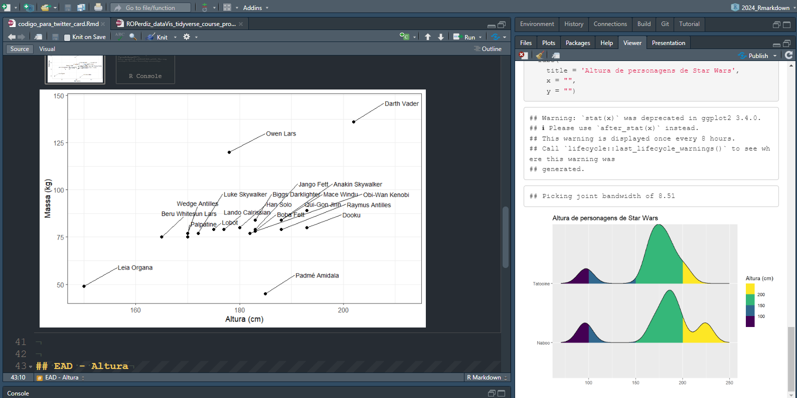

```{r, include=FALSE}
# estafuncao checa se os pacotes em `lista_de_pacotes` estao instalados no seu computador; se nao estiverem, a funcao vai instalar para vc
lista_de_pacotes <- c("ggplot2")
pacote_nao_instalado <- lista_de_pacotes[!(lista_de_pacotes %in% installed.packages()[,"Package"])]
if(length(pacote_nao_instalado)) {install.packages(pacote_nao_instalado)}
```


## Análise exploratória de dados

Vou analisar o conjunto de dados chamado `iris`.

```{r, echo=FALSE}
head(iris, 5)
```

Aqui escrevo mais texto sobre meu conjunto de dados.

### Gráficos

```{r, echo=TRUE}
library("ggplot2")
iris |> 
  ggplot(aes(Sepal.Length, Sepal.Width)) +
  geom_point()
```


## Colocarei uma figura localizada em outra pasta

Usarei o caminho relativo.  

